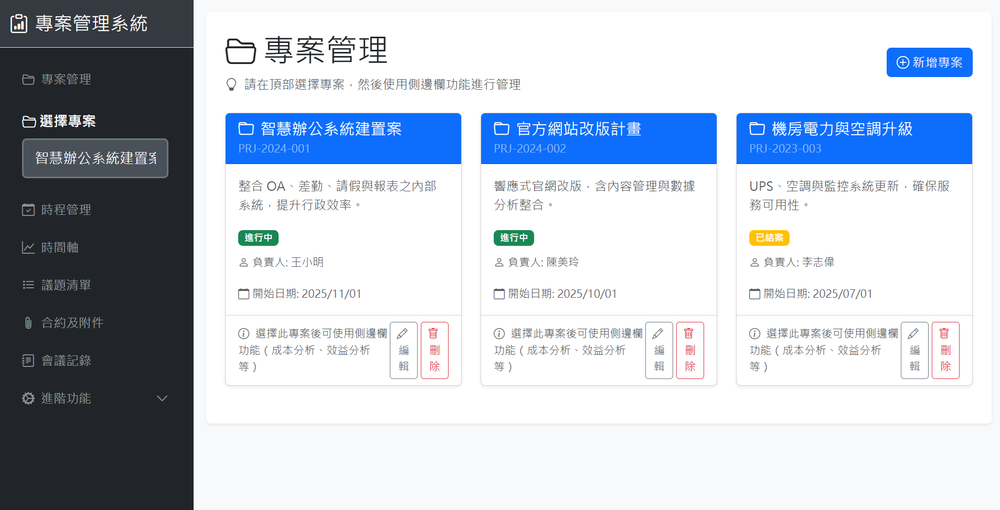
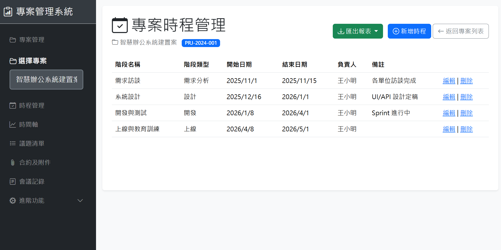
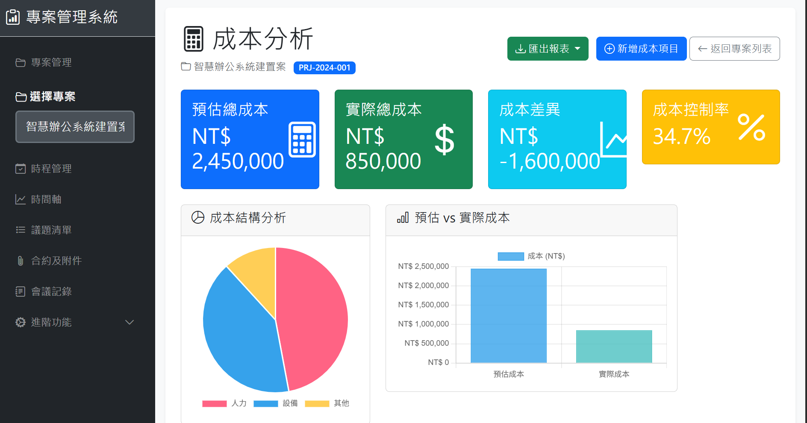

# 專案管理系統

以專案為單位管理發包時程、議題、附件與會議記錄，並支援廠商提案與成本／效益分析。

## 功能（側邊選單）

| 區塊 | 功能 |
|------|------|
| 主選單 | **專案管理**：建立／編輯專案，選定專案後可使用以下功能 |
| | **時程管理**：階段時程的新增、編輯、刪除 |
| | **時間軸**：時程視覺化 |
| | **議題清單**：議題的建立與管理 |
| | **合約及附件**：上傳與下載合約、附件 |
| | **會議記錄**：會議記錄的建立與管理 |
| 進階功能 | **廠商提案管理**：廠商提案、預算、時程與評語 |
| | **成本分析**：成本項目與分析 |
| | **效益分析**：效益項目與分析 |

## 畫面截圖







## 安裝與執行

- 需安裝 [.NET SDK](https://dotnet.microsoft.com/download)（本專案為 .NET 10）。
- 在專案目錄下執行：

```bash
cd TargetProjectManage
dotnet run
```

瀏覽器開啟提示的網址（通常為 `https://localhost:5xxx` 或 `http://localhost:5xxx`）即可使用。

## 技術

- .NET 10、Razor Pages、Entity Framework Core（Sqlite／InMemory）、Bootstrap。


